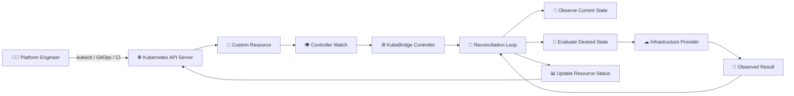
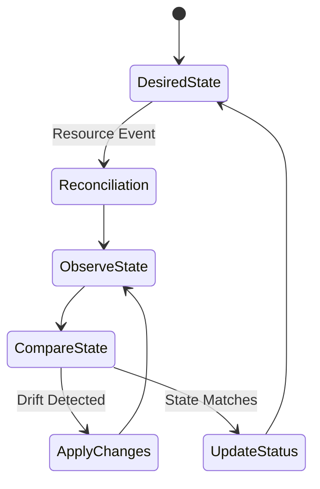

<div align="center">


# KubeBridge

### Kubernetes-Native Infrastructure Bridge

**Declarative infrastructure management through controllers, APIs, and reconciliation.**

<br/>

<a href="https://github.com/KandakatlaChandramouli/Kubebridge/stargazers">
  
</a>
<a href="https://github.com/KandakatlaChandramouli/Kubebridge/forks">
  
</a>
<a href="https://github.com/KandakatlaChandramouli/Kubebridge/issues">
  
</a>
<a href="https://github.com/KandakatlaChandramouli/Kubebridge/actions">
  
</a>

<br/><br/>

<a href="https://go.dev/">
  
</a>
<a href="https://kubernetes.io/">
  
</a>
<a href="https://github.com/kubernetes-sigs/controller-runtime">
  
</a>
<a href="https://www.docker.com/">
  
</a>
<a href="https://github.com/features/actions">
  
</a>

<br/><br/>

<a href="#quick-start">
  
</a>
<a href="#architecture">
  
</a>
<a href="#contributing">
  
</a>

</div>

<br/>

<div align="center">

> **Infrastructure intent in. Reconciled state out.**

</div>

---

## What is KubeBridge?

KubeBridge is an open-source Kubernetes controller for managing infrastructure-oriented resources through Kubernetes-native declarative workflows.

The project brings infrastructure management closer to the Kubernetes control plane by using familiar platform-engineering concepts:

* Declarative configuration
* Kubernetes Custom Resources
* Controller-based reconciliation
* Continuous desired-state evaluation
* Status-driven feedback
* GitOps-compatible workflows

KubeBridge is built around a simple principle:

```text
Users define intent.
Kubernetes stores state.
Controllers reconcile reality.
```

---

# Architecture

<div align="center">


</div>



### Control Plane Flow

```text
┌───────────────────────┐
│   Platform Engineer   │
│                       │
│ kubectl / GitOps / CI │
└───────────┬───────────┘
            │
            ▼
┌───────────────────────┐
│   Kubernetes API      │
│                       │
│ Custom Resources      │
└───────────┬───────────┘
            │ Watch Events
            ▼
┌───────────────────────┐
│      KubeBridge       │
│                       │
│ Controller + Manager  │
└───────────┬───────────┘
            │
            ▼
┌───────────────────────┐
│ Reconciliation Engine │
│                       │
│ Observe → Compare     │
│ Plan → Apply → Status │
└───────────┬───────────┘
            │
            ▼
┌───────────────────────┐
│ Infrastructure Layer  │
│                       │
│ Provider / Platform   │
└───────────────────────┘
```

---

# Why KubeBridge?

Modern infrastructure environments involve APIs, providers, configuration files, deployment tools, and operational dashboards.

KubeBridge explores a Kubernetes-native approach where infrastructure intent becomes part of the same control-plane workflow used to operate applications.

| Traditional Workflow              | KubeBridge Workflow        |
| --------------------------------- | -------------------------- |
| Manual scripts                    | Declarative resources      |
| Separate configuration systems    | Kubernetes API             |
| Imperative commands               | Reconciliation             |
| Manual state checking             | Resource status            |
| Disconnected infrastructure tools | Kubernetes-native workflow |
| One-time execution                | Continuous convergence     |

The goal is not to replace every infrastructure tool.

The goal is to provide a consistent control-plane abstraction for infrastructure-oriented operations.

---

# Core Concepts

| Component       | Responsibility                             |
| --------------- | ------------------------------------------ |
| Kubernetes API  | Stores desired configuration               |
| Custom Resource | Represents infrastructure intent           |
| Controller      | Watches and processes resource changes     |
| Reconciler      | Compares desired and observed state        |
| Provider Layer  | Applies or retrieves infrastructure state  |
| Status          | Reports progress, conditions, and failures |

### Desired State Model



---

# Reconciliation Lifecycle

1. A user creates or updates a Kubernetes resource.
2. The Kubernetes API stores the desired configuration.
3. KubeBridge receives the resource event.
4. The controller loads the resource specification.
5. The reconciler observes the current infrastructure state.
6. Desired and observed states are compared.
7. Required changes are applied.
8. Resource status is updated.
9. The controller continues reconciling until state converges.

```text
        ┌───────────────┐
        │ Desired State │
        └───────┬───────┘
                │
                ▼
        ┌───────────────┐
        │ Watch Event   │
        └───────┬───────┘
                │
                ▼
        ┌───────────────┐
        │ Reconcile     │
        └───────┬───────┘
                │
                ▼
        ┌───────────────┐
        │ Observe State │
        └───────┬───────┘
                │
                ▼
        ┌───────────────┐
        │ Compare State │
        └───────┬───────┘
                │
          ┌─────┴─────┐
          │           │
          ▼           ▼
   ┌────────────┐ ┌────────────┐
   │ Apply      │ │ No Change  │
   │ Changes    │ │ Required   │
   └─────┬──────┘ └──────┬─────┘
         │               │
         └───────┬───────┘
                 ▼
        ┌────────────────┐
        │ Update Status  │
        └────────────────┘
```

---

# Technology Stack

<div align="center">

| Technology                                                                                                      | Purpose                                       |
| --------------------------------------------------------------------------------------------------------------- | --------------------------------------------- |
|                                                  | **Go** — controller implementation            |
|             | **Kubernetes** — control plane                |
|  | **controller-runtime** — controller framework |
|                          | **Docker** — container packaging              |
|                | **GitHub Actions** — continuous integration   |

</div>

---

# Repository Structure

```text
KubeBridge/
│
├── api/
│   └── v1alpha1/
│       ├── types.go
│       └── zz_generated.deepcopy.go
│
├── controllers/
│   └── kubebridge_controller.go
│
├── config/
│   ├── crd/
│   ├── rbac/
│   ├── manager/
│   └── samples/
│
├── internal/
│   └── ...
│
├── test/
│   └── ...
│
├── .github/
│   └── workflows/
│       └── ci.yaml
│
├── Dockerfile
├── Makefile
├── PROJECT
├── go.mod
├── go.sum
└── README.md
```

> Keep this section synchronized with the actual repository as new packages and infrastructure components are added.

---

# Quick Start

## Prerequisites

Install the following tools:

* Go
* Docker or another OCI-compatible container runtime
* Kubernetes cluster
* `kubectl`
* Git

## Clone the Repository

```bash
git clone https://github.com/KandakatlaChandramouli/Kubebridge.git
cd Kubebridge
```

## Install Dependencies

```bash
go mod download
```

## Run Tests

```bash
go test ./...
```

## Build the Project

```bash
go build ./...
```

---

# Local Development

## Run the Controller

If the repository Makefile provides the target:

```bash
make run
```

Alternatively:

```bash
go run ./main.go
```

## Run Unit Tests

```bash
go test ./... -count=1
```

## Run Static Analysis

```bash
go vet ./...
```

## Format Code

```bash
gofmt -w .
```

## Build a Linux Binary

```bash
CGO_ENABLED=0 GOOS=linux GOARCH=amd64 \
go build -o bin/kubebridge .
```

## Build the Container Image

```bash
docker build -t kubebridge:dev .
```

---

# Kubernetes Deployment

KubeBridge is intended to run as a Kubernetes controller.

Typical controller-runtime projects use:

```bash
make install
make deploy
```

Before deployment, verify the available Makefile targets:

```bash
make help
```

Check the generated resources:

```bash
kubectl get crd
kubectl get pods -A
```

Inspect controller logs:

```bash
kubectl logs -n <namespace> deployment/<controller-deployment>
```

---

# Configuration Model

KubeBridge uses Kubernetes resources to represent desired infrastructure state.

The actual API version and resource kinds should always match the CRDs defined in the repository.

General declarative workflow:

```yaml
apiVersion: <project-api-version>
kind: <project-resource-kind>
metadata:
  name: example-resource
spec:
  # Desired configuration
```

Apply a resource using:

```bash
kubectl apply -f resource.yaml
```

Inspect its state:

```bash
kubectl get <resource-kind> example-resource -o yaml
```

Inspect recent Kubernetes events:

```bash
kubectl get events --sort-by=.lastTimestamp
```

---

# Testing Strategy

KubeBridge follows a layered testing model.

### Unit Tests

Validate individual functions, API types, reconciliation logic, and internal components.

```bash
go test ./...
```

### Controller Tests

Important scenarios include:

* Resource creation
* Resource updates
* Resource deletion
* Invalid specifications
* Reconciliation retries
* Status updates
* Missing dependencies
* Provider failures

### Integration Testing

Where configured, integration tests validate behavior against Kubernetes test environments.

The exact integration setup should follow the repository's test configuration.

---

# Observability

Infrastructure controllers should provide clear operational feedback.

Areas to observe:

| Signal              | Purpose                          |
| ------------------- | -------------------------------- |
| Controller Logs     | Debug reconciliation behavior    |
| Kubernetes Events   | Understand resource lifecycle    |
| Resource Conditions | Track success and failure        |
| Status Fields       | Report current state             |
| Provider Errors     | Identify infrastructure failures |
| Retry Behavior      | Understand recovery attempts     |

Useful commands:

```bash
kubectl get pods -A
```

```bash
kubectl get events --sort-by=.lastTimestamp
```

```bash
kubectl describe <resource-kind> <resource-name>
```

```bash
kubectl logs -n <namespace> deployment/<controller-deployment>
```

---

# Security Principles

KubeBridge should follow Kubernetes security best practices.

### Recommended Practices

* Use dedicated service accounts.
* Apply least-privilege RBAC permissions.
* Store credentials outside source code.
* Use Kubernetes Secrets or external secret-management systems.
* Restrict access to infrastructure custom resources.
* Keep container images and dependencies updated.
* Avoid committing kubeconfigs, tokens, credentials, or private keys.
* Review generated RBAC manifests before deployment.

Security is part of the controller design, not an afterthought.

---

# Project Status

KubeBridge is an evolving open-source infrastructure project.

The repository currently focuses on establishing a Kubernetes-native foundation for infrastructure reconciliation.

Production-readiness should not be assumed without validating:

* Provider integrations
* Failure recovery behavior
* Retry and backoff logic
* Integration-test coverage
* Metrics and tracing
* High-availability deployment
* Upgrade procedures
* Security review
* Performance under real workloads

This README intentionally avoids unsupported production claims.

---

# Roadmap

Potential future directions include:

* Expanded infrastructure resource support
* Provider abstraction improvements
* More robust reconciliation behavior
* Prometheus metrics
* Distributed tracing
* GitOps integrations
* Multi-cluster support
* Policy and governance integration
* Improved examples and developer tooling
* Production hardening and performance testing

---

# Contributing

Contributions are welcome.

Before opening a pull request:

```bash
gofmt -w .
go test ./...
go vet ./...
```

### Contribution Guidelines

1. Create a focused branch.
2. Make a small, complete change.
3. Add or update tests.
4. Update documentation when behavior changes.
5. Keep commits clear and focused.
6. Open a pull request with implementation details and validation results.

---

# License

This project is distributed under the license included in the repository.

If no license has been added yet, add an appropriate open-source license before accepting external contributions.

---

# Maintainer

<div align="center">

### KubeBridge

**KandakatlaChandramouli**

<a href="https://github.com/KandakatlaChandramouli">
  
</a>

<br/><br/>

<a href="https://github.com/KandakatlaChandramouli/Kubebridge/stargazers">
  
</a>

</div>

---

<div align="center">

**Built with Go. Powered by Kubernetes. Designed for Infrastructure Automation.**

<br/>

<sub>KubeBridge — bringing declarative infrastructure closer to the Kubernetes control plane.</sub>

</div>
