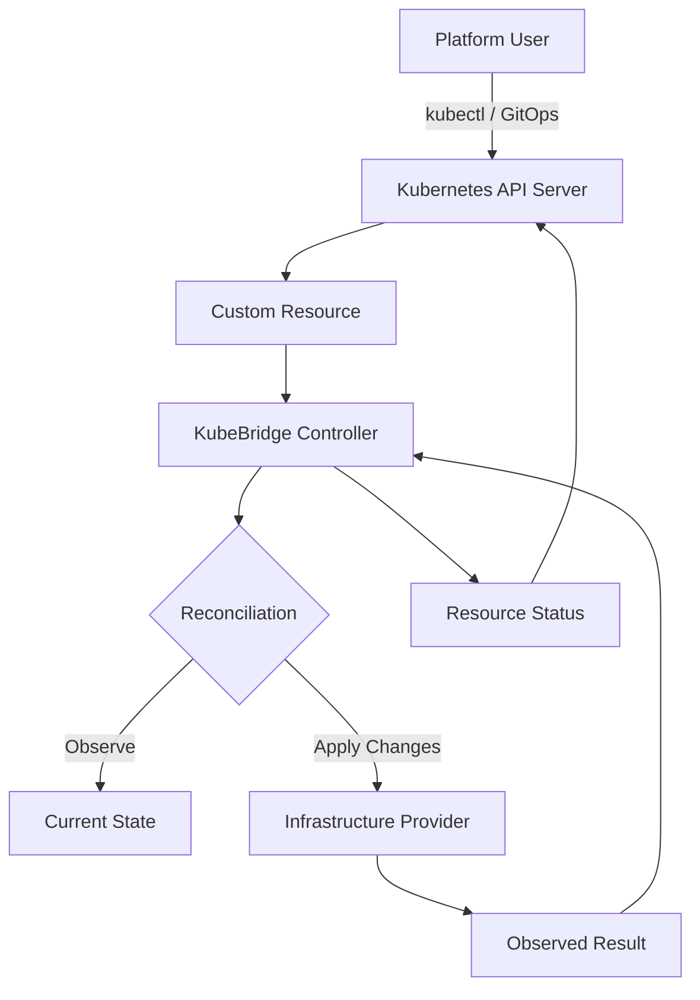

# KubeBridge

### Kubernetes-Native Infrastructure Bridge

KubeBridge is an open-source Kubernetes controller for managing infrastructure-oriented resources through Kubernetes-native declarative workflows.

Instead of requiring infrastructure configuration to be handled entirely through separate scripts, dashboards, or manual operations, KubeBridge brings infrastructure intent closer to the Kubernetes control plane.

> Define the desired state. Let the controller reconcile it.

---

## Overview

KubeBridge is designed around the Kubernetes operator pattern.

Users declare what they want through Kubernetes resources. The KubeBridge controller watches those resources, evaluates the desired state, performs reconciliation, and continuously works toward the requested outcome.

```text
┌───────────────────────┐
│   Kubernetes User     │
│                       │
│ kubectl / GitOps / CI │
└───────────┬───────────┘
            │
            ▼
┌───────────────────────┐
│   Kubernetes API      │
│                       │
│ Custom Resources      │
└───────────┬───────────┘
            │ Watch
            ▼
┌───────────────────────┐
│      KubeBridge       │
│                       │
│ Controller + Reconcile│
└───────────┬───────────┘
            │
            ▼
┌───────────────────────┐
│ Infrastructure Layer  │
│                       │
│ Provider / Platform   │
└───────────────────────┘
```

---

## Why KubeBridge?

Modern infrastructure platforms often involve multiple tools, APIs, configuration formats, and operational workflows.

KubeBridge explores a simpler model:

* Kubernetes as the declarative interface
* Custom Resources as infrastructure intent
* Controllers as reconciliation engines
* Status fields as operational feedback
* GitOps and CI/CD as natural delivery mechanisms

This approach allows infrastructure workflows to become part of the same ecosystem already used for application deployment and platform operations.

---

## Core Concepts

| Concept             | Purpose                                       |
| ------------------- | --------------------------------------------- |
| Desired State       | Describes what the user wants                 |
| Custom Resource     | Stores infrastructure intent in Kubernetes    |
| Controller          | Watches resources and performs reconciliation |
| Reconciliation Loop | Compares desired and observed state           |
| Status              | Communicates current conditions and progress  |
| Kubernetes API      | Provides the control-plane interface          |

The central principle is that infrastructure should be managed through declarative state rather than a collection of imperative commands.

---

## Architecture



### Reconciliation Flow

1. A user creates or updates a Kubernetes custom resource.
2. The Kubernetes API stores the desired configuration.
3. KubeBridge receives an event through its controller watch.
4. The reconciler reads the resource specification.
5. The controller evaluates the current state.
6. Required changes are applied to the managed infrastructure.
7. The resource status is updated.
8. The reconciliation loop continues until the desired and observed states converge.

---

## Project Structure

```text
.
├── api/
│   └── v1alpha1/
│       ├── types.go
│       └── zz_generated.deepcopy.go
│
├── controllers/
│   └── kubebridge_controller.go
│
├── config/
│   ├── crd/
│   ├── rbac/
│   ├── manager/
│   └── samples/
│
├── internal/
│   └── ...
│
├── test/
│   └── ...
│
├── Dockerfile
├── Makefile
├── PROJECT
├── go.mod
├── go.sum
└── README.md
```

> The directory structure above should be kept synchronized with the repository as the project evolves.

---

## Technology Stack

| Layer                | Technology                             |
| -------------------- | -------------------------------------- |
| Language             | Go                                     |
| Control Plane        | Kubernetes                             |
| Controller Framework | controller-runtime                     |
| API Definitions      | Kubernetes Custom Resource Definitions |
| Deployment           | Kubernetes manifests                   |
| Testing              | Go testing ecosystem                   |
| CI/CD                | GitHub Actions                         |
| Packaging            | Container image                        |

KubeBridge follows standard Kubernetes controller conventions wherever possible.

---

## Installation

### Prerequisites

Before installing KubeBridge, ensure the following tools are available:

* Go
* Docker or another OCI-compatible container runtime
* Kubernetes cluster
* `kubectl`
* Access to the required infrastructure provider or platform

### Clone the Repository

```bash
git clone https://github.com/KandakatlaChandramouli/Kubebridge.git
cd Kubebridge
```

### Install Dependencies

```bash
go mod download
```

### Run Tests

```bash
go test ./...
```

### Build the Controller

```bash
go build ./...
```

### Deploy to Kubernetes

Use the repository's generated Kubernetes manifests or deployment workflow.

Typical controller-runtime projects use:

```bash
make install
make deploy
```

If the repository's Makefile defines different targets, use those targets as the source of truth.

---

## Configuration

KubeBridge uses Kubernetes resources to represent desired infrastructure state.

A typical custom resource follows this general pattern:

```yaml
apiVersion: kubebridge.example.com/v1alpha1
kind: InfrastructureResource
metadata:
  name: example-resource
spec:
  # Desired infrastructure configuration
```

The exact `apiVersion`, `kind`, and specification fields must match the CRDs currently defined in the repository.

### Declarative Workflow

```text
1. Write YAML
      ↓
2. Apply to Kubernetes
      ↓
3. Controller receives event
      ↓
4. Reconcile desired state
      ↓
5. Update infrastructure
      ↓
6. Report status
```

---

## Development

### Run the Controller Locally

```bash
make run
```

Or, depending on the repository's available targets:

```bash
go run ./main.go
```

### Run Unit Tests

```bash
go test ./... -count=1
```

### Run Static Analysis

```bash
go vet ./...
```

### Build a Linux Binary

```bash
CGO_ENABLED=0 GOOS=linux GOARCH=amd64 go build -o bin/kubebridge .
```

### Build the Container Image

```bash
docker build -t kubebridge:dev .
```

### Run Code Generation

If API types or CRDs are modified, regenerate the corresponding artifacts using the repository's configured Makefile targets.

Common controller-runtime commands include:

```bash
make generate
make manifests
```

---

## Testing Strategy

KubeBridge follows a layered testing approach.

### Unit Testing

Validates individual functions, API behavior, reconciliation logic, and internal components.

```bash
go test ./...
```

### Controller Testing

Validates how resources are processed by the reconciler.

Important scenarios include:

* Resource creation
* Resource updates
* Resource deletion
* Invalid specifications
* Reconciliation retries
* Status updates
* Missing dependencies
* Provider failures

### Integration Testing

Where configured, integration tests validate behavior against Kubernetes test environments.

The exact integration-test configuration should follow the repository's test setup.

---

## Operational Model

KubeBridge is designed to operate as a Kubernetes controller.

```text
┌───────────────┐
│ Desired State │
└───────┬───────┘
        │
        ▼
┌────────────────────┐
│ Controller Watches │
└────────┬───────────┘
         │
         ▼
┌────────────────────┐
│ Reconcile Request  │
└────────┬───────────┘
         │
         ▼
┌────────────────────┐
│ Compare States     │
└────────┬───────────┘
         │
         ▼
┌────────────────────┐
│ Apply / Observe    │
└────────┬───────────┘
         │
         ▼
┌────────────────────┐
│ Update Status      │
└────────┬───────────┘
         │
         └──────────────► Repeat
```

The reconciliation loop is expected to be idempotent: running reconciliation repeatedly should converge toward the same desired result rather than creating uncontrolled duplicate changes.

---

## Security Considerations

KubeBridge operates inside the Kubernetes control plane and should be deployed according to least-privilege principles.

Recommended practices:

* Use dedicated Kubernetes service accounts.
* Grant only the RBAC permissions required by the controller.
* Avoid storing provider credentials directly in source code.
* Use Kubernetes Secrets or an external secret-management system where appropriate.
* Restrict access to infrastructure custom resources.
* Review container image permissions and runtime configuration.
* Keep dependencies and base images updated.
* Avoid committing credentials, tokens, kubeconfigs, or generated private configuration files.

---

## Observability

A Kubernetes controller should be operated with visibility into:

* Controller logs
* Reconciliation failures
* Resource conditions
* Kubernetes events
* Provider API errors
* Retry behavior
* Resource status transitions

For local debugging:

```bash
kubectl logs -n <namespace> deployment/<controller-deployment>
```

Inspect managed resources with:

```bash
kubectl get <resource> -o yaml
```

Inspect events with:

```bash
kubectl get events --sort-by=.lastTimestamp
```

---

## Limitations and Project Status

KubeBridge is an evolving open-source project.

The current implementation should be evaluated against the actual repository before making production-readiness claims.

The following areas may require additional development as the project grows:

* Broader provider integrations
* Advanced retry and backoff strategies
* Stronger validation and admission controls
* Expanded integration-test coverage
* Metrics and tracing
* High-availability deployment patterns
* Upgrade and migration procedures
* Comprehensive operational documentation

This README intentionally avoids claiming capabilities that have not been verified in the codebase.

---

## Roadmap

Potential future directions include:

* Expanded infrastructure resource support
* Improved reconciliation reliability
* Provider abstraction improvements
* Metrics and Prometheus integration
* Distributed tracing
* GitOps-oriented workflows
* Multi-cluster management
* Policy and governance integration
* Better developer tooling and examples
* Production hardening and performance testing

Roadmap priorities may change as implementation and community feedback evolve.

---

## Contributing

Contributions are welcome.

Before submitting a pull request:

1. Create a focused branch.
2. Make the smallest complete change necessary.
3. Add or update tests where appropriate.
4. Run formatting and validation checks.
5. Update documentation when behavior changes.
6. Open a pull request with a clear description.

Recommended checks:

```bash
gofmt -w .
go test ./...
go vet ./...
```

Please keep pull requests focused and avoid mixing unrelated changes.

---

## License

This project is distributed under the license included in the repository.

If a license file has not yet been added, choose and add an appropriate open-source license before publishing the project for external contributions.

---

## Maintainer

**KubeBridge**

Created and maintained by:

**KandakatlaChandramouli**

GitHub:
https://github.com/KandakatlaChandramouli

---

## Final Note

KubeBridge is built around a simple idea:

> Infrastructure intent should be declarative, observable, and continuously reconciled.

By bringing infrastructure workflows closer to Kubernetes-native operations, KubeBridge aims to provide a consistent foundation for managing infrastructure through familiar platform-engineering patterns.
